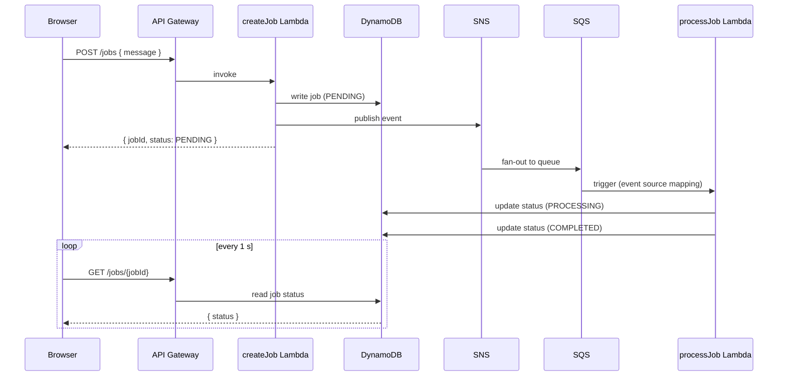

# Event Pipeline — React · Lambda · SNS/SQS · DynamoDB

Serverless event-driven job pipeline: a React UI posts jobs to **API Gateway**; a `createJob` Lambda writes the record to **DynamoDB** and publishes to **SNS**, which fans out to **SQS**; a `processJob` Lambda consumes the queue and transitions the job `PENDING → PROCESSING → COMPLETED`. The entire backend deploys in one command via the **Serverless Framework** — no infrastructure provisioning required.

**[→ Portfolio demo](https://bganguly.github.io/?open=serverless)**

---

## Using the App

1. Click **Create Job** — the React app posts to API Gateway; `createJob` Lambda writes a `PENDING` record to DynamoDB and publishes an SNS event.
2. SNS fans out to SQS; `processJob` Lambda consumes the message, transitions the job to `PROCESSING`, then marks it `COMPLETED`.
3. The UI polls `GET /jobs/{jobId}` until the job completes and displays the result.

---

| Component | Implementation |
|---|---|
| **Frontend** | React 18 + TypeScript + Vite; polls `GET /jobs/{id}` until terminal state; `VITE_API_BASE_URL` injected via `.env.local` |
| **API** | AWS API Gateway HTTP API — `POST /jobs`, `GET /jobs/{jobId}` |
| **createJob Lambda** | Node.js 24; writes `PENDING` record to DynamoDB, publishes SNS event; IAM-scoped to the created table and topic |
| **SNS → SQS fan-out** | SNS topic → SQS standard queue + dead-letter queue; decouples publish from processing |
| **processJob Lambda** | SQS event source mapping; updates DynamoDB `PROCESSING` → simulates work → `COMPLETED` |
| **Job store** | DynamoDB `jobs` table; keyed on `jobId` (UUID); `status` attribute drives UI state machine |
| **IaC** | Serverless Framework `serverless.yml` — API Gateway, Lambdas, SNS, SQS, DynamoDB, IAM roles, CloudWatch logs |
| **Deploy** | `npm run deploy` (root) → `npx sls deploy` in `backend/` — packages and deploys the full stack, prints `HttpApiUrl` |

---

## Screenshots


---

## Architecture

### Job submission flow — step by step

1. **Browser → API Gateway** — user clicks Create Job; the React app POSTs `{ "message": "..." }` to the API Gateway HTTP API endpoint.
2. **API Gateway → createJob Lambda** — Lambda writes a new job record to DynamoDB (`status: PENDING`) and publishes an event to the SNS topic, then returns `{ jobId, status: PENDING }` to the browser.
3. **SNS → SQS** — SNS delivers the event to the subscribed SQS standard queue asynchronously; failed deliveries after retries move to the dead-letter queue.
4. **SQS → processJob Lambda** — the SQS event source mapping triggers `processJob`; Lambda updates the DynamoDB record to `PROCESSING`, runs the job, then updates to `COMPLETED`.
5. **UI polling** — the React UI calls `GET /jobs/{jobId}` on a 1 s interval; when it receives `COMPLETED`, polling stops and the result is displayed.



### Key design decisions

| Concern | Approach |
|:--|:--|
| **SNS → SQS fan-out** | SNS decouples job creation from processing; adding a second consumer (e.g. audit Lambda) requires only a new SQS subscription, no changes to `createJob` |
| **Dead-letter queue** | Messages that fail processing after the retry limit move to a DLQ — failed jobs are inspectable without blocking the main queue |
| **Serverless Framework** | `serverless.yml` declares all resources (API Gateway, Lambdas, SNS, SQS, DynamoDB, IAM, CloudWatch); a single `sls deploy` provisions and wires the entire stack |
| **Node.js 24 pinning** | `engines` + `engine-strict` in `package.json` prevent silent version drift — `npm install` fails if the wrong Node version is active |
| **Plain Lambda handlers** | No Express/Nest wrapper — keeps cold starts minimal and the handler surface area small for a demo-scale workload |
| **CORS** | Open (`*`) for demo convenience; restrict origins to the CloudFront/S3 domain before production use |

---

## Running

```bash
npm run deploy          # deploy backend (sls deploy) + print HttpApiUrl
npm run dev             # start frontend dev server (after setting VITE_API_BASE_URL)
npm run remove          # tear down the Serverless stack
npm run where           # print AWS account, region, stage, API URL, DynamoDB status
```

### Prerequisites

- Node.js 24.x only (enforced via `engines` + `engine-strict`)
- AWS credentials configured (`aws configure`)
- Serverless Framework account login if your setup requires it

### Node version

```bash
nvm use        # switches to Node 24 (pinned in .nvmrc)
nvm install 24 # if not installed yet
```

### Backend deploy

From the repo root:

```bash
npm run deploy
```

`npm run deploy` runs `npx sls deploy` in `backend/`, deploying:

```
  ├─ API Gateway (HTTP API)
  ├─ createJob Lambda  — POST /jobs → DynamoDB write + SNS publish
  ├─ processJob Lambda — SQS consumer → PROCESSING → COMPLETED
  ├─ SNS topic → SQS queue + dead-letter queue
  ├─ DynamoDB jobs table
  └─ outputs HttpApiUrl — set as VITE_API_BASE_URL in frontend/.env.local
```

Advanced options:

```bash
STAGE=dev REGION=us-east-1 npm run deploy
```

### Frontend

From the repo root:

```bash
npm run dev
```

Set `VITE_API_BASE_URL` in `frontend/.env.local` to the `HttpApiUrl` printed by `npm run deploy`.

### Tear down

```bash
npm run remove
STAGE=dev REGION=us-east-1 npm run remove
```

## Folder layout

- `backend`: Serverless + Lambda + AWS resources
- `frontend`: React + TypeScript (Vite)
